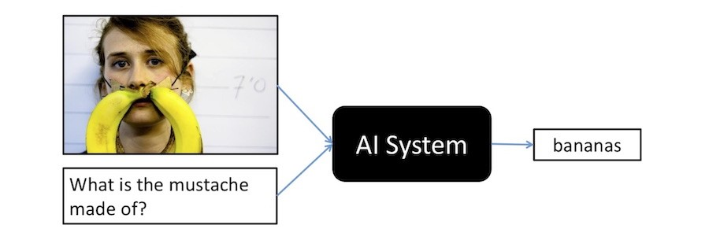
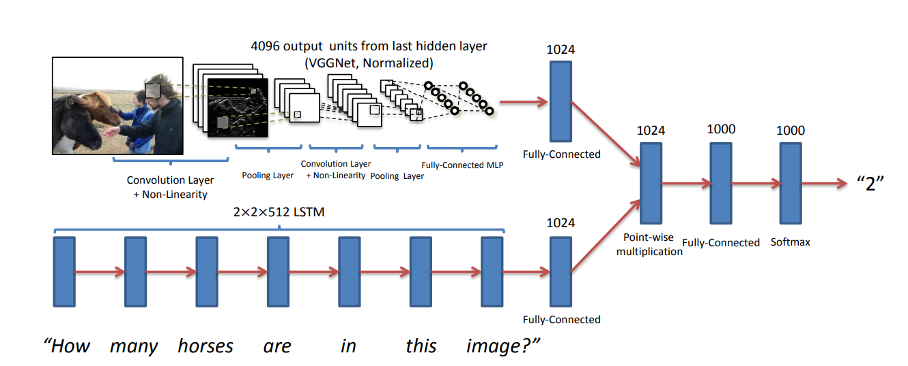
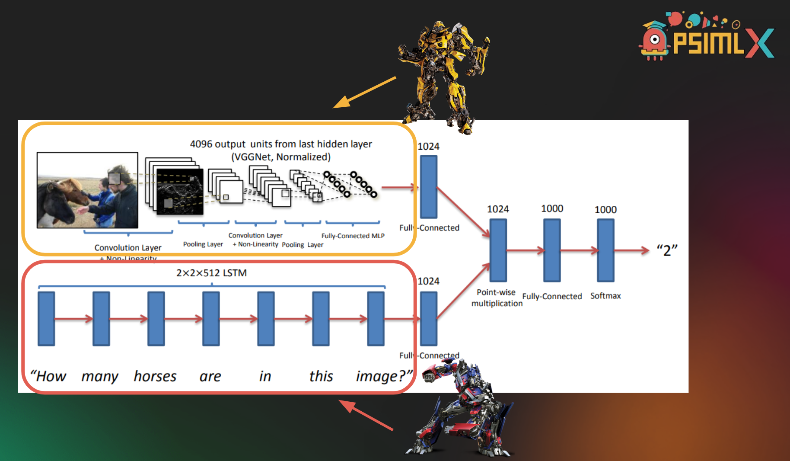
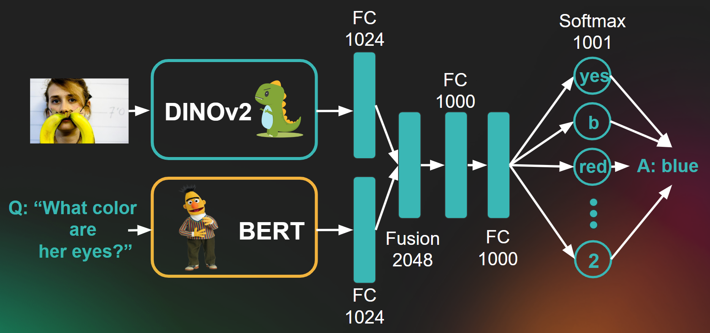
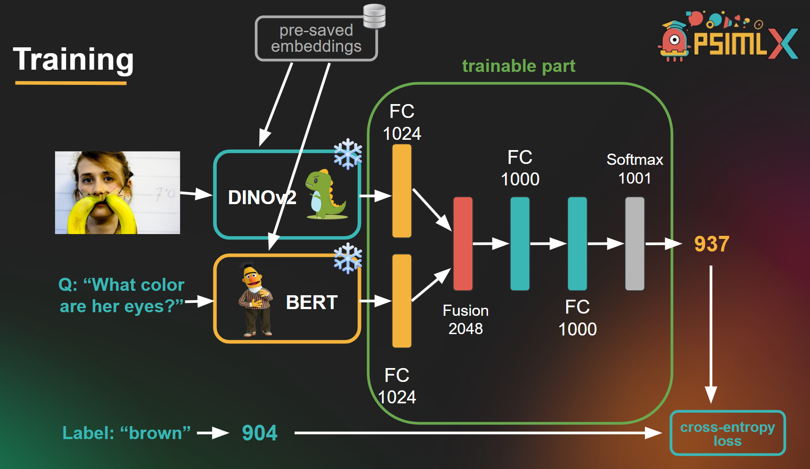

# Visual Question Answering

This repository contains our project from [PSIML X](https://psiml.pfe.rs/) summer school. 

The goal of the project was research of both historic and current VQA technologies, together with adding modifications to existing pipelines and trying to better current results.

*You can find more information on the project by checking out our [presentation](docs/presentation.pdf)*

# Authors
- [Nemanja Vujadinovic](https://github.com/vujadinovicn)
- [Tina Mihajlovic](https://github.com/tince250)

## What is VQA?
Visual Question Answering (VQA) is an interdisciplinary research area that involves understanding both vision and language to answer questions based on visual content. 



## Why VQA?
With the rise of the popularity of foundation models and the all-overarching efforts in developing AGI, multi-modal models that ideally have the ability to understand all possible modalities (audio, image/video, text...) have surfaced as one of the paths towards advancing the mentioned efforts.

We deem them a highly fruitful area for both scientific research and industry applications - which is why we decided to dedicate our project days at the summer school to better understanding how these models work. 

VQA is just one of the problems that can be solved by multi-modal NNs. It's a starting point to a plethora of exciting topics and we aim to continue diving deeper into this field.

## Starting point
Originally, we wanted to fully grasp and implement one of the first solutions to the VQA problem, presented in the [2015 VQA paper](https://arxiv.org/abs/1505.00468).

The paper introduces a dataset for training VQA models, as well as proposes a VQA model architecture:



From here we'd like to highlight the three main parts of the VQA model:
1. **Text Encoder** - transforms natural language into embeddings (LSTM in the paper)
2. **Image Encoder** - transforms images into embeddings (VGG net in the paper)
3. **Fusion NN**- where text and image embeddings meet + an MLP to map the relationships between them

So, for VQA, we need a way to embed the image we want to ask our model about, as well as the question itself - aka we need to understand both text and images. Not only that, but we have to form that understanding through embeddings that are in the same vector space - to later be able to fuse those vectors and learn the relationship between the features in that space.

## Our modification
The year 2015 was longer ago than we'd like to admit, and with AI being such a rapidly developing field - we've learned a lot about NNs since the original VQA paper came out.

So, we started thinking about ways we could modify the setup proposed in the [2015 VQA paper](https://arxiv.org/abs/1505.00468).

### #1 Changing Text and Image Encoders

Our initial modification idea is simple - form a better understanding of the text and image by using better encoders! And what "better" nets have we uncovered since 2015? Transformers!



We replaced the LSTM with *BERT encoder* for text, and VGG for *DINOv2 ViT* for image encoding:



**Important:** We freeze these large models during training and use them *as is* - this allows us to save on compute but poses a potential problem with our pipeline -> text and image embeddings are not in the same space.

This is why we added *projection layers* (a simple FC layer each) like in the original 2015 paper, to map those initial embeddings output from the two powerful but not made-to-work-together models, into as close of the same space as possible.

### #2 Playing with Fusion
There are different ways to combine the information from the projected image and text embeddings.

We tried the following three:
1. *Stacking* - we simply stack together the image and text embeddings, concatenating those two vectors.
2. *Multiplication* - point-wise multiplication of the vectors is performed.
3. *Attention* - using a multi-head attention mechanism to fuse the image and text embeddings by focusing on the most relevant parts of each modality.

## Implementation
With our theory and experiment ideas sorted out, here's how we implemented our VQA models:

### Dataset
We utilize the [VQA v2](https://visualqa.org/download.html) dataset, which is one of the most popular datasets for training and evaluating VQA models. The dataset is automatically downloaded and preprocessed using the provided script.

To download the dataset:
```bash
bash download_dataset.sh
```

### Data pre-processing
To up the efficiency of our training, we pre-computed the embeddings for all of our train and validation images, questions, and answers. 

This optimization is somewhat specific to our pipeline, thanks to the fact that we do not change the weights of the pre-trained DinoV2 and BERT models.

### Config 
Both the train.py and inference.py scripts rely on the [config.yml](config.yml) file.

Modify this file to change any of the desired parameters.

### Training
Here's a nifty illustration of our training process:



For it, we implemented a custom train pipeline that can be accessed by running the train.py script:

```bash
python train.py
```

The training process will be logged using TensorBoard, which can be accessed as follows:
```bash
tensorboard --logdir=runs
```

We trained our model on the pre-saved embedding train split, using an A100 GPU.

Feel free to check out our current [best model](results/best_model.pkl) - 51% accuracy on the validation split.

Logs from our trainings can be found in the [tensorboard/](tensorboard/) folder.

### Inference
Run the inference.py script to perform VQA on new images and questions:

```bash
python inference.py --image <path_to_image> --question "<your_question>"
```

Currently, inference is done with our current [best model](results/best_model.pkl) - you can change this in [configl.yml](config.yml) script.

### Dependencies
The project requires Python 3.8+ and the dependencies listed in requirements.txt. 

Install them using:

```bash
pip install -r requirements.txt
```

### Usage
You can use our repo in two main ways:
1. Simply run inference.py on your own images and questions and test our current best solution :)
2. Try to reproduce our whole workflow and make modifications to it! Let us know if you get any new great insights and results :)

## Pretrained models

| Model               |Training accuracy | Validation accuracy | Download    |
|:-------------------:|:-----------------:|:-------------------:|:-----------:|
| VQA-stack I  | 60.1%         | 51%           | [link](https://drive.google.com/file/d/1_1nM1gtF0W4nUXSEiUNQ8UhD6XkXbfZ6/view?usp=sharing) |
| VQA-stack II  | 59.4%         | 50.7%           | [link](https://drive.google.com/file/d/1mbMHEQBOqcMQXmQ2DL3u9b-zLxBedptT/view?usp=sharing) |
| VQA-mul  | 49.8%         | 48.2%           | [link](https://drive.google.com/file/d/1mX-Wz_PEsb7XggT2hBdLeTTDBAq2lj_h/view?usp=sharing) |
| VQA-attention I  | 48.3%         | 44.6%           | [link](https://drive.google.com/file/d/1Gx_jeAT3PMKgnR9NQS20b1EajwBpGPN0/view?usp=sharing) |
| VQA-attention II | 43.2%         | 41.4%           | [link](https://drive.google.com/file/d/1X3gqt3bfQDYI2Y0alNYb1klEOIe0jNNq/view?usp=sharing) |

A corresponding [model card](MODEL_CARD.md) is included in the repository.
